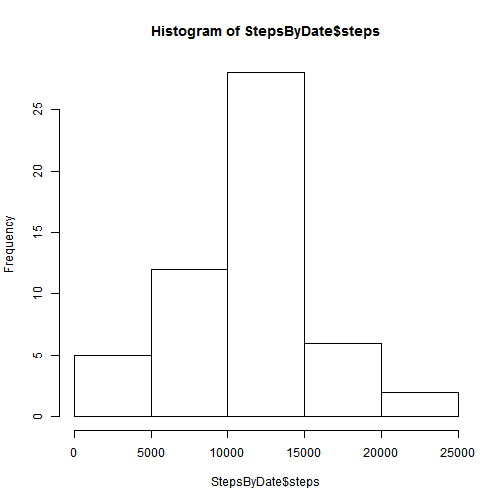
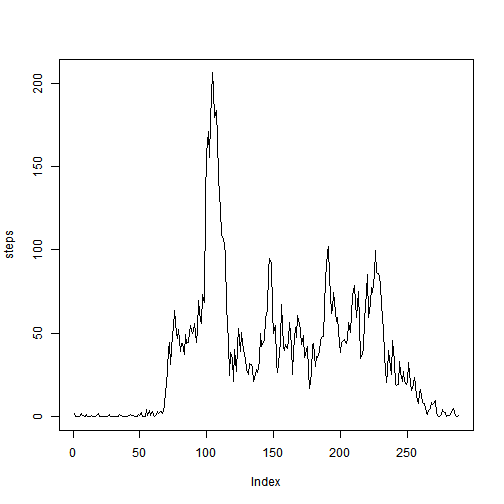
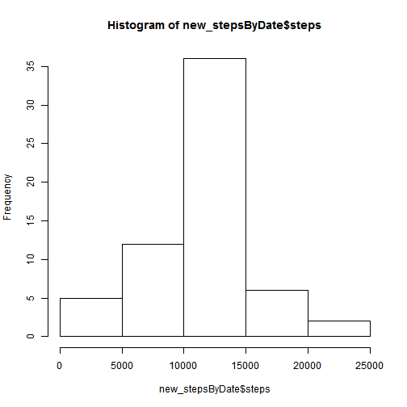
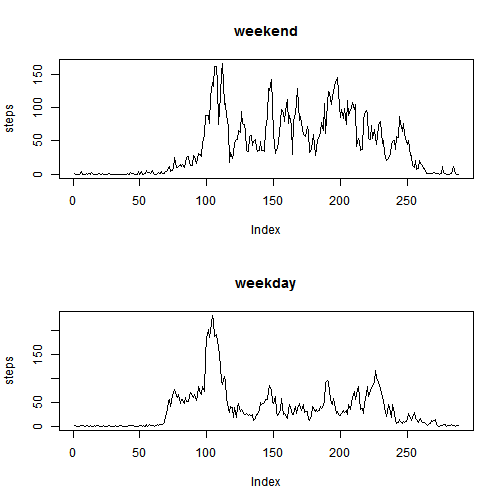

## Peer assignment #1 for Reproducible Data course. 
### Loading and Prepossessing the Data

First the data is read from the downloaded "activity.csv" file, specifying classes for the three columns, named "steps", "date" and "interval".


```r
data<-read.csv("activity.csv", colClasses=c("integer", "Date", "integer"))
```
### What is mean total number of steps taken per day?
For this part we ignore the missing values. First we create a histogram of the total number of steps taken per day

```r
stepsByDate <- aggregate(steps ~ date, data = data, sum) 
hist( StepsByDate$steps )
```

 

Next we calculate the mean and median total number of steps taken per day.

```r
meanSteps <- mean( stepsByDate$steps )
medianSteps <- median( StepsByDate$steps )
```
The mean is 1.0766 &times; 10<sup>4</sup>, while the median is 10765.
### What is the average daily activity pattern?
First we make a time series plot (i.e. type = "l") of the 5-minute interval (x-axis) and the average number of steps taken, averaged across all days (y-axis)

```r
stepsByInterval <- aggregate( steps ~ interval, data=data, mean)
with( stepsByInterval, plot(steps, type='l'))
```

 

Then we find which 5-minute interval, on average across all the days in the dataset, contains the maximum number of steps.

```r
maxInterval <- which.max( stepsByInterval$steps )
```
The result is interval 104, which corresponds to 8 hours and 35 minutes.

### Imputing missing values

Firt we calculate the total number of missing values in the dataset (i.e. the total number of rows with NAs)

```r
totalNA <- sum(is.na(data))
```
We find a total of 2304 missing values.

We chose a simple strategy of replacing NA's with the average steps per day already calculated for that interval. 

```r
new_steps <- ifelse( is.na(data[,1]), stepsByInterval$steps, data[,1] )
```
Then we create a new data set with a replaced column of updated steps.

```r
new_data <- data
new_data[,1] <- new_steps
```
As before, we create a new histogram of total number of steps per day.

```r
new_stepsByDate <- aggregate(steps ~ date, data = new_data, sum) 
hist(new_stepsByDate$steps)
```

 

This looks surprisingly similar to the old histogram.
Next we calculate the new mean and median.

```r
new_meanSteps <- mean( new_stepsByDate$steps )
new_medianSteps <- median( new_stepsByDate$steps )
```
The new mean is the same as before (1.0766 &times; 10<sup>4</sup>), while the median is very close(1.0766 &times; 10<sup>4</sup>). In our case, it turns out all the missing values corresponded to several complete days. So when we replaced them with averaged data and averaged again, there was no change in the mean. This is because if you add the average of a sum of numbers to a sum of those numbers, the new average is uneffected. The median did change slightly however, because with the new data set there were additional days added. So the day that fell in the middle was different.

### Are there differences in activity patterns between weekdays and weekends?

We can create a day-of-the-week variable with weekdays().

```r
new_data$day<-weekdays(new_data$date)
```
And similarly, a weekend/weekday factor variable.

```r
new_data$dayType<-factor(ifelse(new_data$day %in% c("Saturday","Sunday"),"weekend","weekday"))
```
                              
Then we can subset the updated data accordingly and plot the mean steps by interval for each of weekend and weekday averaged data.

```r
weekend_data<- subset(new_data, dayType=="weekend")
weekend_data_plot <- aggregate( steps ~ interval, data=weekend_data, mean)

weekday_data<- subset(new_data, dayType=="weekday")
weekday_data_plot <- aggregate( steps ~ interval, data=weekday_data, mean)

par(mfrow=c(2,1))
with( weekend_data_plot, plot(steps, type='l', main="weekend"))
with( weekday_data_plot, plot(steps, type='l', main="weekday"))
```

 

We see indeed more activity throughout the weekend days, despite each having a similar morning burst.

This concludes the assignment.
